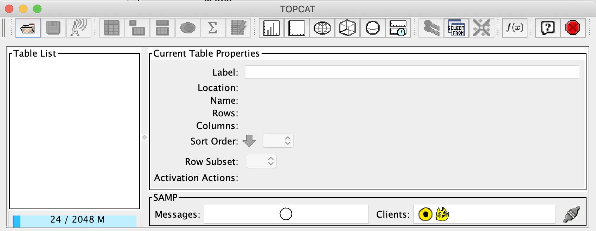

# TOPCAT Analysis
`Author: Palvisha Sharma`

_This project was created as content for a course on Data Science at York University, Toronto, Canada._

------------------------------------

"Data cleaning and Analysis using Python and TOPCAT" focuses on data cleaning and the basic analysis of astronomical data accquired through TOPCAT.
The information provided below will discuss TOPCAT, the installation process, and how to search for data from various astronomical surveys on TOPCAT, as well as retrieving the data for analysis. 

# What is TOPCAT?

TOPCAT stands for Tool for Operations on Catalogues  and Tables, and is an interactive software equipped with various facilities to visualize astronomical data. 
It is particularly useful in managing large sets of tabular data. 

A more detailed list of features and their functions can be found at this [link](http://www.star.bris.ac.uk/~mbt/topcat/#features).

# TOPCAT Installation
 
  
   ### For MacOS 
  > For Apple Mac users, the installation file can be downloaded at: <a href="http://www.star.bris.ac.uk/~mbt/topcat/topcat-full.dmg">MacOS X TOPCAT</a> 
  
   #### Troubleshooting for MacOS:
   When downloading and installing TOPCAT, you may run into an error that says: 
    
   _App can’t be opened because it is from an unidentified developer_
    
    1. In this case, move the `.dmg` installation file for TOPCAT from your `Downloads` 
    folder to `Applications` folder. 
   
    2. Open the installation file in the Applications folder by double clicking on the `.dmg` file. This will 
    unzip a READme and TOPCAT application file into the Applications folder. 
   
    3. In the "Applications" folder, find the TOPCAT application, right click on it and select "open". 
    This will override the error.
  
  
  ### For Non-MacOS 
  
  > Download one of two `.jar` files: 
  
  > [topcat_full_.jar]()
  
  > [topcat_lite.jar]()
  
   ##### **Unix based systems:** 
  
     run the command `chmod +x topcat` in the same directory the `.jar` file is downloaded to.
  
     run the command `topcat`
  
   ##### **Non-Unix systems:**
  
     run the command `chmod +x topcat`
  
     run the command `java -jar topcat-*.jar`.
   
 -------------------------------
 
 _This information was summarized from the [TOPCAT Documentation](http://www.star.bris.ac.uk/~mbt/topcat/). Visit this site for more information_
 # Retrieving data from TOPCAT to analyze in Python

##### 1. When you first open up TOPCAT, you will see a window that looks like this: 

##### 2. Select the "files" tab on the top left.

##### 3. We will be working with data from the Sloan Digital Sky survey, so to retrieve the data, select the "VizieR" tab: 

##### 4. Select "all rows"

##### 5. Set the maximum row count to 200.

##### 6. Select "By Keyword" in the "Catalogue Selection".

##### 7. Enter the keyword "SDSS".

##### 8. Select the SDSS catalogue with the description "Group of Galaxies in SDSS 5 (Tago+, 2008): 

